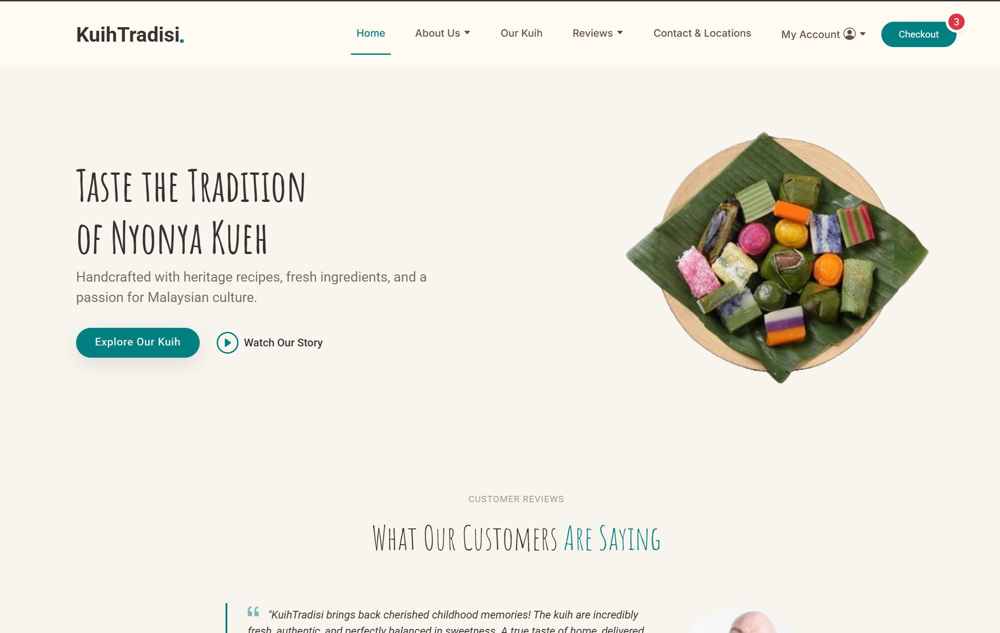
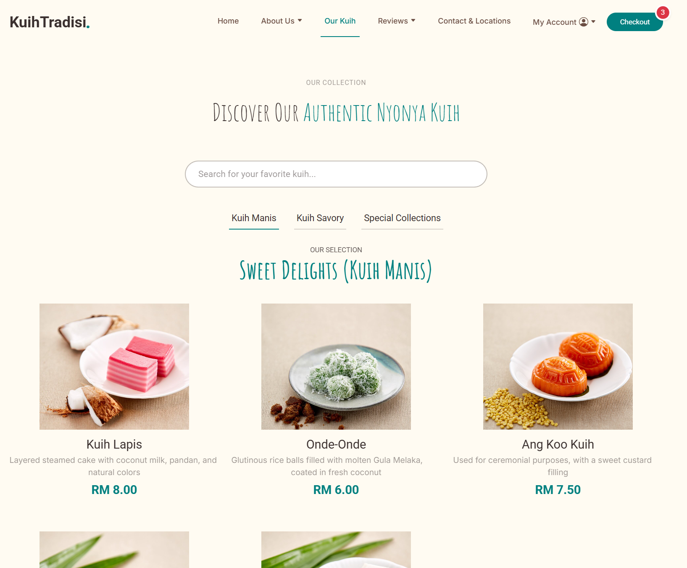
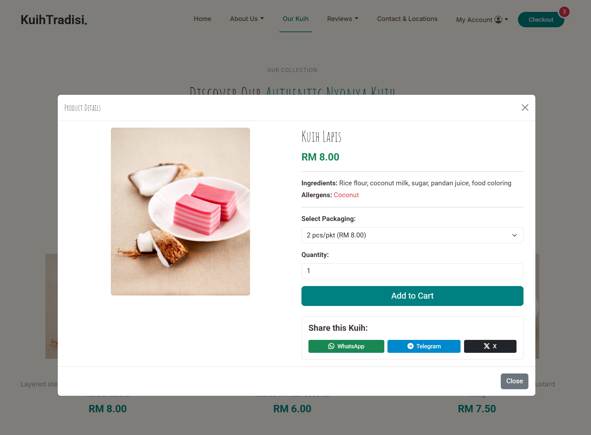
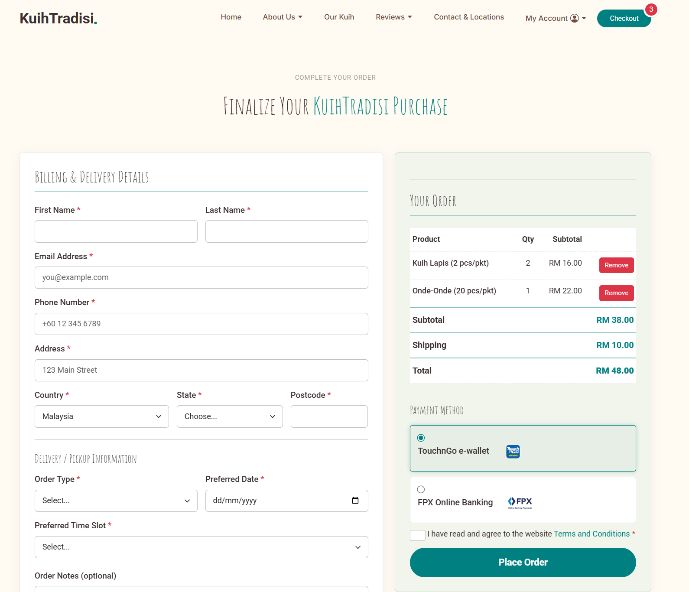
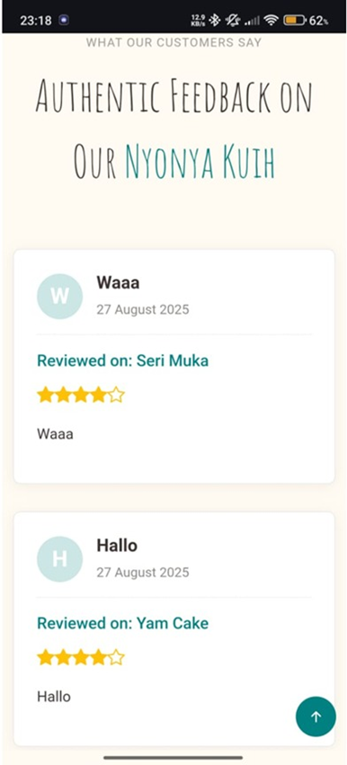
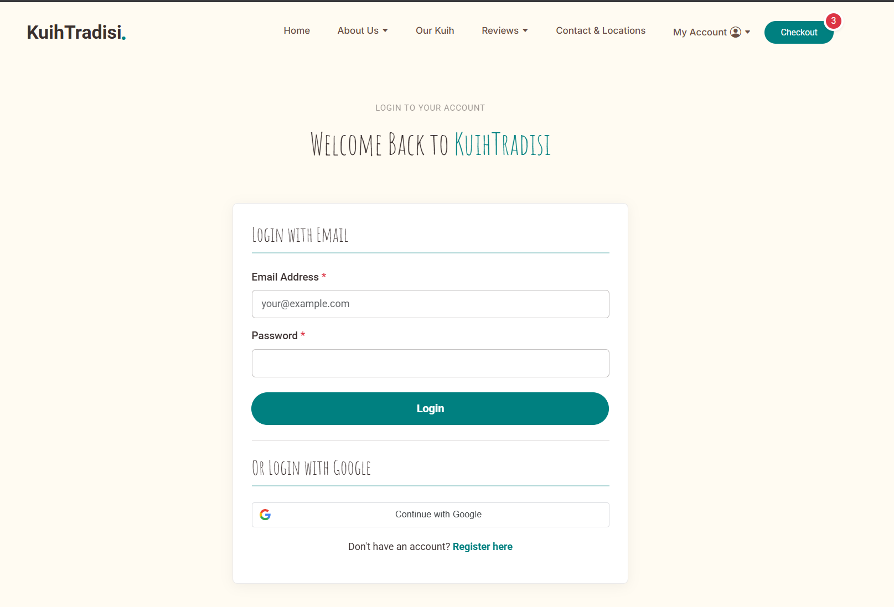

# Kuih Tradisi — Nyonya Kuih E-Commerce Website

Kuih Tradisi is a responsive front-end e-commerce website concept for promoting and selling traditional Malaysian Nyonya kuih online. The project focuses on combining cultural storytelling with a smoother digital shopping experience through responsive design, browser storage, user account features, social sharing, and review functionality.

## Project Overview

This project was developed as a front-end web development assignment to address the lack of a dedicated, trustworthy, and accessible online marketplace for authentic Nyonya kuih. Many existing sellers rely heavily on social media or outdated ordering processes, which make discovery, ordering, and trust-building more difficult for customers. Kuih Tradisi was designed to improve that experience with a more modern, user-friendly, and mobile-responsive website.

## Problem Statement

Traditional Nyonya kuih is culturally significant, but it is not always easy for modern customers to discover, understand, or purchase online. Existing options are often fragmented across social media pages, manual order forms, or basic storefront websites that lack features such as direct ordering, clear product details, customer reviews, and personalization. This project proposes a more complete digital platform that not only supports online ordering, but also helps preserve and promote Malaysian food heritage.

## Tech Stack

   
  
  

| Category            | Technology / Method     | Purpose                                                   |
| ------------------- | ----------------------- | --------------------------------------------------------- |
| Browser Storage API | Local Storage           | Stores cart data so selected items persist while browsing |
|                     | Session Storage         | Preserves checkout form data during the session           |
|                     | Cookies                 | Helps maintain user session and login-related state       |
| API / Data Handling | RESTful API with jQuery | Handles review submission and checkout-related data flows |

## Key Features

1. Responsive layout for desktop and mobile devices using Bootstrap
2. Product browsing with category tabs and search
3. Product modal for viewing details without leaving the menu page
4. Add-to-cart workflow using Local Storage
5. Checkout form with Session Storage to reduce data loss
6. User registration and login
7. Google sign-up and login integration
8. Customer rating and review submission flow
9. Customer reviews display page
10. Social media sharing for products
11. Store locator / contact page with map integration
12. Heritage and artisan pages to strengthen brand storytelling and cultural identity

## Pages Included

The project includes multiple pages to simulate a complete e-commerce experience:

- `index.html`
- `about.html`
- `artisans.html`
- `heritage.html`
- `menu.html`
- `rating.html`
- `review.html`
- `contact.html`
- `login.html`
- `register.html`
- `checkout.html`    

## How the Website Works

### 1. Product Discovery

Users can browse kuih products through a categorized menu and use a search feature to filter items based on names or ingredients. This helps users find products more quickly without reloading the page.

### 2. Product Details and Cart

Each product can be opened in a modal, where users can view details, choose packaging, adjust quantity, and add items to the cart. Cart data is managed using Local Storage so selections persist across the browsing session.

### 3. Checkout Experience

The checkout page is structured as a single-page order flow. Cart contents are loaded dynamically, while billing and delivery information can be preserved using Session Storage to reduce the risk of losing form progress on refresh.

### 4. Reviews and Social Proof

The website includes a rating form and a customer review page to strengthen trust. Reviews are intended to be handled through RESTful API calls with jQuery, with Local Storage used as a cache or fallback for a smoother user experience.

### 5. Account Features

The project also includes account registration and login flows, including Google sign-up and sign-in. Cookies are used to help maintain the user session for a more convenient return visit.

## Highlights

What makes this project strong as a front-end portfolio piece is that it goes beyond a static website. It demonstrates responsive UI design, interactive product browsing, cart persistence, session handling, social sharing, mock API integration, and user account flows within a single themed project. It also shows an effort to combine technical functionality with cultural storytelling and branding.

## What I Learned

Through this project, I strengthened my understanding of building a multi-page front-end application with a consistent user experience across desktop and mobile layouts. I also gained experience working with browser storage, structuring interactive UI flows, integrating third-party services, and designing around real usability issues observed in existing e-commerce websites.

## Demo

Live site (Deprecated): `https://uccd2223-assignment-ecommerce-drchhghyc2c6b9hb.southeastasia-01.azurewebsites.net/index.html`

## Disclaimer

This project was developed as an academic front-end web development assignment. Some flows were designed using mock API integration and browser-based storage to demonstrate front-end concepts such as state persistence, interactivity, and user experience design.
